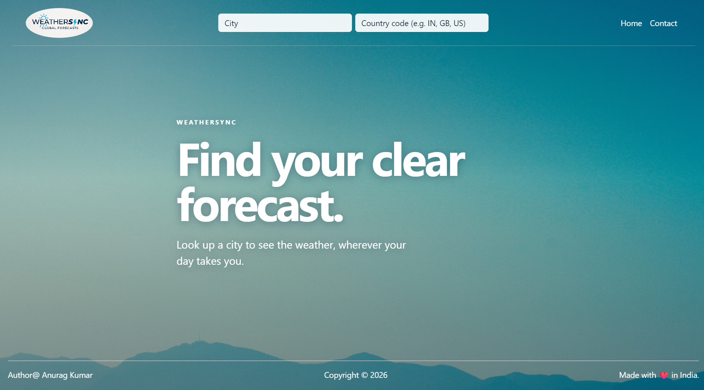
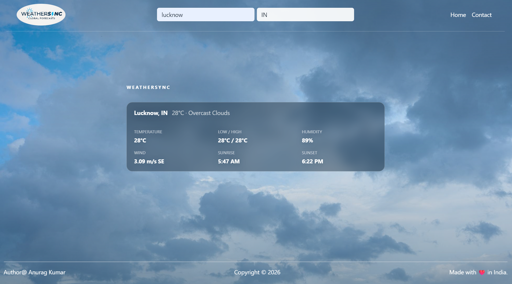
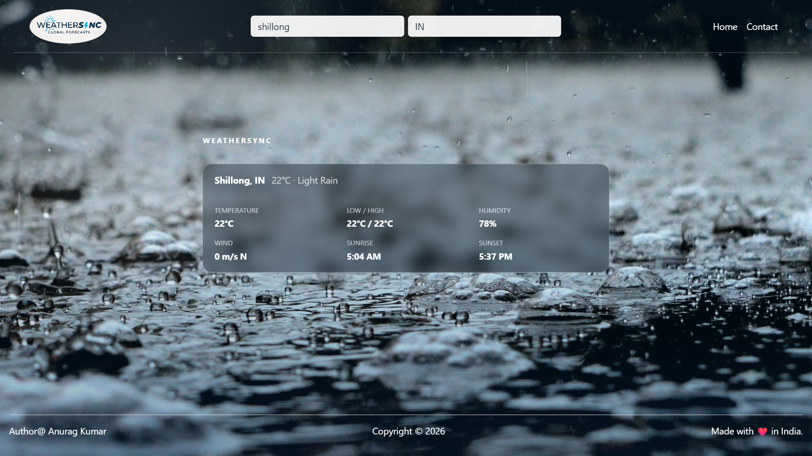

# WeatherSync
WeatherSync is a responsive weather application built with Node.js, Express, EJS, and the OpenWeatherMap API. It displays real-time weather information with dynamic day and night backgrounds.



## Features
- Search weather by city and country code
- Temperature, conditions, humidity, wind, sunrise, and sunset details
- Dynamic weather backgrounds
- Responsive desktop and mobile design
- Contact dropdown with Email, LinkedIn, and GitHub links
- Error handling for invalid searches and API failures

## Technologies
- Node.js
- Express.js
- EJS
- Axios
- Bootstrap
- HTML, CSS, and JavaScript
- OpenWeatherMap API

## Project Structure
```
WeatherAPI/
├── index.js
├── package.json
├── public/
│   ├── images/
│   └── styles/main.css
├── views/
│   ├── index.ejs
│   ├── app.ejs
│   └── partials/
│       ├── header.ejs
│       └── footer.ejs
└── README.md
```
## Installation
```
git clone (https://github.com/kumaranurag00748-byte/Weather_Sync.git)
cd WeatherAPI
npm i

```

Add your OpenWeatherMap API key in index.js, run node index.js and open localhost:3000

## How It Works
Users enter a city and an optional country code in the search form. JavaScript sends this information to the Express backend through the /api/weather endpoint. The backend uses Axios to request current weather data from OpenWeatherMap and returns the response to the browser.
The frontend displays the temperature, weather condition, humidity, wind speed and direction, sunrise, and sunset times. It also selects a suitable day or night background based on the weather condition and API icon. If the city is invalid or the API request fails, an error message is shown.

## Searches






# Caution Regarding API Keys
A demo OpenWeatherMap API key is currently included in the repository configuration for quick setup and testing convenience. However, please note:
- **Shared Rate Limits:** Free-tier keys have strict call limits (e.g., 60 calls/minute, 1,000 calls/day). If multiple users test the app simultaneously, you may experience `429 Too Many Requests` errors.
- **Service Disruption:** The provided demo key may be rotated or revoked at any time without notice.
- **Best Practice:** For reliable testing and production deployments, please [sign up for a free OpenWeatherMap account](https://openweathermap.org/api) to generate your own API key.
